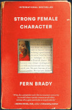

I ran across a video of comedian Fern Brady a few days ago. I thought her jokes and presentation were pretty good and went searching for more.  One of the videos I ran across was her being interviewed by Richard Herring, on his _Richard Herring's Leicester Square Theatre Podcast_.  In the course of that interview I learned both that Fern is autistic and that she had written a book.  This intrigued me so I had to track it down.

_Strong Female Character_(2023) is an autobiography in which she shares her experiences growing up in Scotland as a female with undiagnosed autism. She provides a ton of information related to autism in women and girls. She notes, for example, that autism in females may present quite differently that in males. 

I deeply appreciated her honesty around how it presented in her. She described her meltdowns, how she always felt "out of the loop" in social situations, how she struggled to understand social cues and figurative speech. She described very well the tendency of autistic people to hyper-focus (a trait shared with ADHD folks) on some topic. When it was suggested that she might be autistic she did what many autistic would do: She dug into the topic (more about that in a moment).

Like many autistic people she tended to excel at certain tasks. For her, it was writing and languages. 

She was surprisingly candid in discussing her life experiences, particularly before she was diagnosed and how how those experiences affected her. She is candid both in her book and in several videos I've seen about her time as stripper. She noted, too, the lack of understanding of autism among neurotypical folk, including those who should have a good understanding of autism, such as psychologists and other medical professionals. She shared, for example, that after reading up on the subject she finally gathered the courage to suggest to one medical professional that she might be autistic only to be told that she couldn't possibly have autism because she had a boyfriend and made eye contact. There's so much more to it that that.

All in all, I found her book interesting and enlightening. And just a bit too close to home in some ways. Reading her descriptions of her meltdowns brought back memories of some of my own meltdowns, particularly when I was younger. I have written before that I suspect I may be on that spectrum (a term which she doesn't care for) and her descriptions certainly did not disabuse me of that possibility.

I have really only one minor nit to pick with the book: while she did drop hints throughout the book about her entry into standup comedy, she sort of glossed over how she got there. Now, I realize that that wasn't really the focus of the book, but still it would have been interesting to hear how she actually ended up doing standup, how she landed her first gigs, and so on.  Again, she touched on these topics rather obliquely[^1] but never really told us how that happened.

Overall, it is not a book that I would ever have picked up had my interest not been piqued by her comedy and her openness about autism in that interview. But I'm glad I did. I found it entertaining and informative, though in honesty I expected more humor. But, again, that wasn't her goal with this book.

If you know someone -- particularly a female -- who has, or you suspect has autism I encourage you to read this book. You might see that person in its pages. I got my copy from the local library.

[^1]: As I wrote that, it occurred to me that she often said she struggled with people "not saying what they mean", so she would miss things that were obliquely said. Yet, she was, herself, oblique on this point. 
