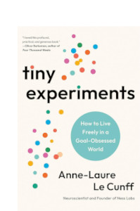

# Tiny Experiments

In recent years I've grown increasingly convinced that hyper-focus on being productive and goal oriented is a prescription for a great deal of stress, anxiety, and dissatisfaction in life. So, when I ran across this book with the subtitle of "How to Live Freely in a Goal-Obsessed World" I had to stop to read it. And I'm glad I did.

The book aims to teach you 10 things (outlined on its [webpage](https://nesslabs.com/book). What I took away from the book was to approach interests and ideas with a scientific perspective. That is, try something for a set amount of time or a set number of attempts (for example, "I will write 30 articles in 30 working days" ) rather than more nebulous goals (e.g. "I will write more") or goals with no clear end date. Then, take a look at what you accomplished -- or didn't. That helps you to see more clearly whether you really are interested in pursuing that activity in the longer term. 

Another thing I took away from the book was to reframe anxiety and negative that

by setting clear, time delimited goals experiences as opportunities for growth. This is nothing new and has been discussed elsewhere in this blog, but it never hurts to revisit some ideas. 

Other concepts included how to understand and manage procrastination, how to let go of mental constructs that are blocking you from achieving your goals. And how to use these ideas to do what you want to do rather than what you believe others expect of you.

I found the book easy to read. And while I'm no longer in the work world so that some of the concepts are not really applicable to me any more, I still am alive and kicking and continue to work on other projects, such as this blog. So, for me, the book encouraged me to step out of my comfort zone a bit and do what I want to do, even if others might think I'm a bit daft for doing it.

So, if you're interested in learning more about how to take control of your life then I recommend this book. That said, I must also say that, just as I've shifted my thinking on "productivity" I've also shifted my thinking on "self-help" such that I generally dismiss book that fall into that category. However, I have to say I found this one to have some valid ideas that can be applied to my own life.
